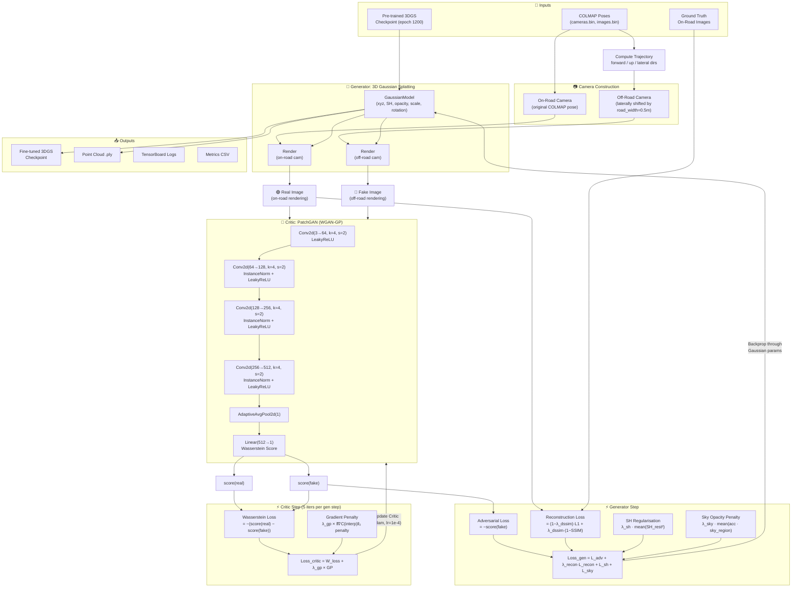

```mermaid
flowchart TB
    subgraph INPUT["📂 Inputs"]
        CKPT["Pre-trained 3DGS\nCheckpoint (epoch 1200)"]
        COLMAP["COLMAP Poses\n(cameras.bin, images.bin)"]
        GT["Ground Truth\nOn-Road Images"]
    end

    COLMAP --> TRAJ["Compute Trajectory\nforward / up / lateral dirs"]

    subgraph CAMERAS["📷 Camera Construction"]
        direction LR
        ON_CAM["On-Road Camera\n(original COLMAP pose)"]
        OFF_CAM["Off-Road Camera\n(laterally shifted by road_width=0.5m)"]
    end

    TRAJ --> OFF_CAM
    COLMAP --> ON_CAM

    subgraph GENERATOR["🎨 Generator: 3D Gaussian Splatting"]
        GAUSS["GaussianModel\n(xyz, SH, opacity, scale, rotation)"]
        RENDER_ON["Render\n(on-road cam)"]
        RENDER_OFF["Render\n(off-road cam)"]
    end

    CKPT --> GAUSS
    ON_CAM --> RENDER_ON
    OFF_CAM --> RENDER_OFF
    GAUSS --> RENDER_ON
    GAUSS --> RENDER_OFF

    RENDER_ON --> REAL_IMG["🟢 Real Image\n(on-road rendering)"]
    RENDER_OFF --> FAKE_IMG["🔴 Fake Image\n(off-road rendering)"]

    subgraph CRITIC_NET["🧠 Critic: PatchGAN (WGAN-GP)"]
        direction TB
        CONV1["Conv2d(3→64, k=4, s=2)\nLeakyReLU"]
        CONV2["Conv2d(64→128, k=4, s=2)\nInstanceNorm + LeakyReLU"]
        CONV3["Conv2d(128→256, k=4, s=2)\nInstanceNorm + LeakyReLU"]
        CONV4["Conv2d(256→512, k=4, s=2)\nInstanceNorm + LeakyReLU"]
        POOL["AdaptiveAvgPool2d(1)"]
        FC["Linear(512→1)\nWasserstein Score"]
        CONV1 --> CONV2 --> CONV3 --> CONV4 --> POOL --> FC
    end

    REAL_IMG --> CRITIC_NET
    FAKE_IMG --> CRITIC_NET

    FC --> SCORE_R["score(real)"]
    FC --> SCORE_F["score(fake)"]

    subgraph CRITIC_STEP["⚡ Critic Step (5 iters per gen step)"]
        W_LOSS["Wasserstein Loss\n= −(score(real) − score(fake))"]
        GP["Gradient Penalty\nλ_gp × ‖∇C(interp)‖₂ penalty"]
        LOSS_C["Loss_critic = W_loss + λ_gp × GP"]
    end

    SCORE_R --> W_LOSS
    SCORE_F --> W_LOSS
    W_LOSS --> LOSS_C
    GP --> LOSS_C
    LOSS_C -->|"Update Critic\n(Adam, lr=1e-4)"| CRITIC_NET

    subgraph GEN_STEP["⚡ Generator Step"]
        LOSS_ADV["Adversarial Loss\n= −score(fake)"]
        LOSS_RECON["Reconstruction Loss\n= (1−λ_dssim)·L1 + λ_dssim·(1−SSIM)"]
        LOSS_SH["SH Regularisation\nλ_sh · mean(SH_rest²)"]
        LOSS_SKY["Sky Opacity Penalty\nλ_sky · mean(acc · sky_region)"]
        LOSS_G["Loss_gen = L_adv + λ_recon·L_recon + L_sh + L_sky"]
    end

    SCORE_F --> LOSS_ADV
    REAL_IMG --> LOSS_RECON
    GT --> LOSS_RECON
    LOSS_ADV --> LOSS_G
    LOSS_RECON --> LOSS_G
    LOSS_SH --> LOSS_G
    LOSS_SKY --> LOSS_G
    LOSS_G -->|"Backprop through\nGaussian params"| GAUSS

    subgraph OUTPUT["📤 Outputs"]
        CKPT_OUT["Fine-tuned 3DGS\nCheckpoint"]
        PLY["Point Cloud .ply"]
        TB["TensorBoard Logs"]
        CSV_OUT["Metrics CSV"]
    end

    GAUSS --> CKPT_OUT
    GAUSS --> PLY
```