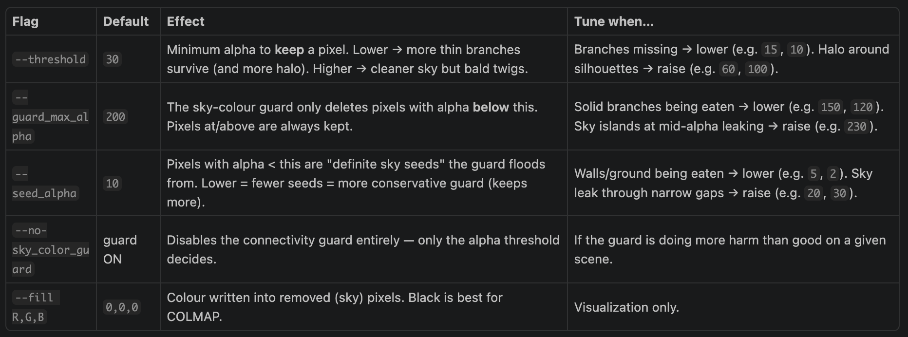

# create sparse point cloud
python colmap_pointcloud_sparse.py --output_dir data/colmap_pointcloud_sparse

# sparse point cloud
python colmap_pointcloud_sparse.py \
  --image_dir data/cubemap_faces_nosky_rgb \
  --image_pattern '*.png' \
  --output_dir data/colmap_pointcloud_sparse_v2

# dense point cloud
python colmap_pointcloud_dense.py \
  --sparse_dir data/colmap_pointcloud_sparse_v2/sparse/<best> \
  --image_dir data/cubemap_faces_nosky_rgb \
  --output_dir data/colmap_pointcloud_dense_v2

# alpha matting

python bake_nosky_rgb.py --overwrite 

## Preserve maximum branch detail (more sky leak ok):
python bake_nosky_rgb.py --overwrite --threshold 15 --guard_max_alpha 150

## Cleanest sky, accept a few lost twigs:
python bake_nosky_rgb.py --overwrite --threshold 80 --guard_max_alpha 230 --seed_alpha 20

## Walls/ground being damaged:
python bake_nosky_rgb.py --overwrite --seed_alpha 3

## Just trust the matte, no colour guard:
python bake_nosky_rgb.py --overwrite --no-sky_color_guard --threshold 50